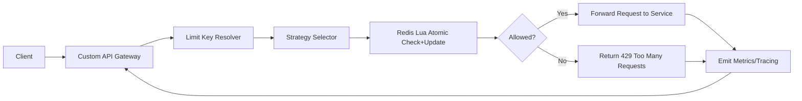

# Distributed Rate Limiter

> 🚪 Used behind our own Custom API Gateway for centralized traffic control.

A high-performance distributed rate limiter built with Redis and Lua scripts for concurrency-safe request throttling across multiple API instances.

---

## Problem It Solves

When traffic is served by many application instances, in-memory counters produce inconsistent limits and race conditions. This project centralizes rate-limit state in Redis and uses atomic Lua execution to keep decisions correct under concurrent load.

## Key Features

- Supports Token Bucket and Sliding Window strategies
- Atomic check-and-update logic via Redis Lua scripts
- Multi-instance safe with shared Redis-backed state
- Per-user, per-key, and global throttling support
- Strategy-oriented design for adding new algorithms
- Low-latency decision path suitable for gateway-level use

## Architecture



## How it works (high level)

- Client requests arrive at stateless API nodes.
- The rate limiter computes the effective key (user, route, or global scope).
- A Redis Lua script executes limit check and counter update atomically.
- The script returns a single decision: allow or reject.
- API responds immediately and avoids race conditions across nodes.

## How It Works (Detailed)

### Token Bucket

- Each subject receives a bucket with `capacity` and `refill_rate`
- Tokens are refilled based on elapsed time
- Request consumes one token if available
- Request is rejected when bucket is empty

### Sliding Window

- Requests are tracked inside a moving time window
- Old entries are removed as the window advances
- Decision is based on count within current window
- Provides tighter control against burst abuse

## Atomicity with Lua

Redis Lua scripts guarantee that limit evaluation and state mutation run as one operation:

```lua
-- simplified flow
local current = redis.call("GET", key) or "0"
if tonumber(current) < limit then
  redis.call("INCR", key)
  return 1
else
  return 0
end
```

This prevents race conditions that appear when read/update are split across multiple round trips.

## Performance / Benchmarks

Representative baseline for a local setup (single Redis instance, pipelined client, warm cache):

- Decision latency: typically 1-2 ms p50
- Throughput: scales with Redis CPU/network and key cardinality
- Lua overhead: negligible compared to network cost in most deployments

Use these as directional numbers; production figures depend on topology, TTL strategy, and traffic distribution.

## Example Use Cases

- API gateway throttling per API key
- Login and OTP brute-force protection
- Abuse prevention for high-cost endpoints
- Fair-usage limits across tenant plans

## Trade-offs and Design Decisions

- Redis is chosen for speed and atomic primitives over strong relational consistency
- Lua scripting increases correctness and determinism, but adds script lifecycle management
- Sliding Window provides precision with higher state cost than coarse-grained counters

## Next Improvements

- Add adaptive limits based on user tier and traffic behavior
- Add multi-region replication strategy for geo-distributed deployments
- Provide ready-to-run benchmark harness and reproducible reports
- Add observability dashboards for rejection reason and hot-key analysis

## Benchmark Methodology

To keep benchmark claims comparable across revisions, run tests with:

- Fixed request mix and fixed key-cardinality profile
- Warmed Redis instance and stable network path
- Reported p50/p95 latency plus total rejected/allowed ratio
- Same script version and identical Redis configuration
